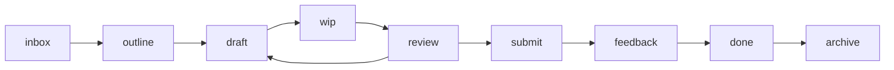

---
tags:
  - guide
  - mba
---

# Tags Guide

> Hệ thống tag nhất quán cho vault MBA.

---

## 1. Tag cấp chương trình

| Tag | Khi nào dùng |
|-----|--------------|
| `#mba` | Tất cả content MBA |
| `#mba/active` | Môn đang học |
| `#mba/completed` | Môn đã xong |
| `#mba/thesis` | Liên quan luận văn |
| `#mba/semester/1` | Học kỳ 1 |
| `#mba/semester/2` | Học kỳ 2 |
| `#mba/semester/3` | Học kỳ 3 |
| `#mba/semester/4` | Học kỳ 4 |

---

## 2. Tag loại nội dung (`#type/`)

| Tag | Dùng cho |
|-----|----------|
| `#type/course-home` | File 00_Course-Home.md |
| `#type/lecture-note` | Ghi chú bài giảng |
| `#type/reference` | Tài liệu tham khảo |
| `#type/reading-note` | Ghi chú khi đọc sách/bài báo |
| `#type/assignment` | Bài tập cá nhân |
| `#type/group-work` | Bài tập nhóm |
| `#type/case-study` | Phân tích case study |
| `#type/presentation` | Bài thuyết trình |
| `#type/exam-prep` | Tài liệu ôn thi |
| `#type/thesis` | Nội dung luận văn |
| `#type/ai-context` | Context file cho AI |
| `#type/ai-output` | Output từ AI cần review |

---

## 3. Tag trạng thái (`#stage/`)

Theo lifecycle ISO 19650:

| Tag | Ý nghĩa | Tương đương ISO |
|-----|----------|-----------------|
| `#stage/inbox` | Mới nhận, chưa xử lý | - |
| `#stage/outline` | Đang lên dàn ý | S0 - WIP |
| `#stage/draft` | Đang viết bản nháp | S0 - WIP |
| `#stage/wip` | Đang làm dở | S0 - WIP |
| `#stage/review` | Sẵn sàng review | S1 - Shared |
| `#stage/submit` | Đã nộp/hoàn thành | S2 - Published |
| `#stage/feedback` | Có phản hồi/điểm | S2 - Published |
| `#stage/done` | Hoàn tất mọi việc | S2 - Published |
| `#stage/archive` | Lưu trữ | S3 - Archived |

---

## 4. Tag lĩnh vực (`#area/`)

| Tag | Môn liên quan |
|-----|---------------|
| `#area/economics` | CS01 |
| `#area/research` | CS02 |
| `#area/statistics` | CS03 |
| `#area/law` | CS04 |
| `#area/strategy` | MS01 |
| `#area/marketing` | MS02 |
| `#area/finance` | MS03 |
| `#area/hr` | MS04 |
| `#area/operations` | MS05 |
| `#area/accounting` | MS06 |
| `#area/project-management` | MS07 |
| `#area/mis` | MS08 |
| `#area/supply-chain` | MS09 |
| `#area/ethics` | MS10 |
| `#area/leadership` | MS11 |
| `#area/international-business` | MS12 |
| `#area/innovation` | MS13 |
| `#area/ecommerce` | MS14 |

---

## 5. Tag AI workflow (`#ai/`)

| Tag | Khi nào dùng |
|-----|--------------|
| `#ai/context-ready` | Context file sẵn sàng cho AI đọc |
| `#ai/needs-review` | Output AI chưa kiểm tra |
| `#ai/final-checked` | Output AI đã duyệt xong |

---

## Quy tắc sử dụng

1. **Mỗi note nên có ít nhất**: `#mba` + 1 tag `#type/` + 1 tag `#stage/`
2. **Course-Home** luôn có: `#mba`, `#mba/active` hoặc `#mba/completed`, `#type/course-home`, `#area/...`
3. **Deliverables** luôn có: `#mba`, `#type/...`, `#stage/...`
4. **Không tạo tag mới** ngoài danh sách trên trừ khi thật sự cần
5. **Tag nằm trong frontmatter** (YAML), không inline trong body

---

## Tags KHÔNG dùng nữa (deprecated)

Các tag cũ sau đã thay thế:

| Tag cũ | Thay bằng |
|--------|-----------|
| `#status/active` | `#mba/active` |
| `#status/done` | `#stage/done` |
| `#status/draft` | `#stage/draft` |
| `#status/pending` | `#stage/inbox` |
| `#status/review` | `#stage/review` |
| `#status/archived` | `#stage/archive` |
| `#subject` | `#type/course-home` |
| `#lecture-note` | `#type/lecture-note` |
| `#assignment` | `#type/assignment` |
| `#book-note` | `#type/reading-note` |

---
**Navigation**: [[00_Dashboard/Home|Home]]
