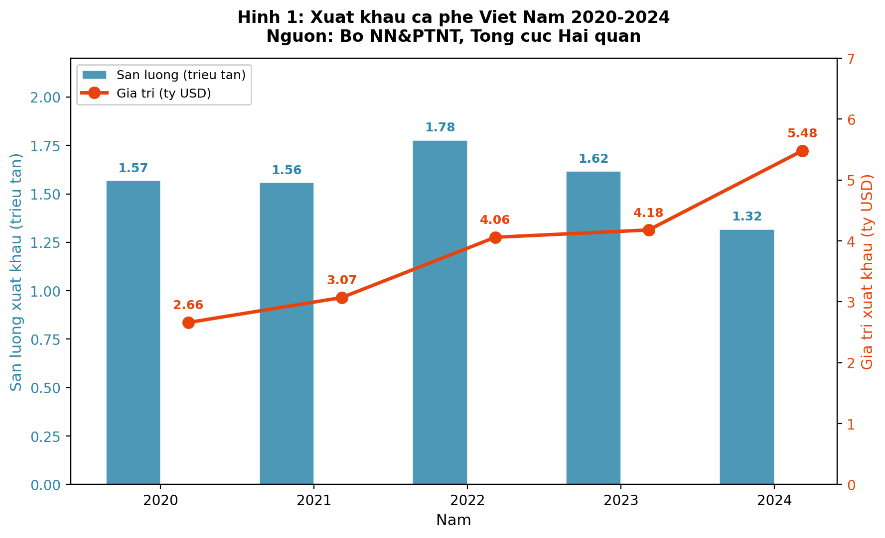
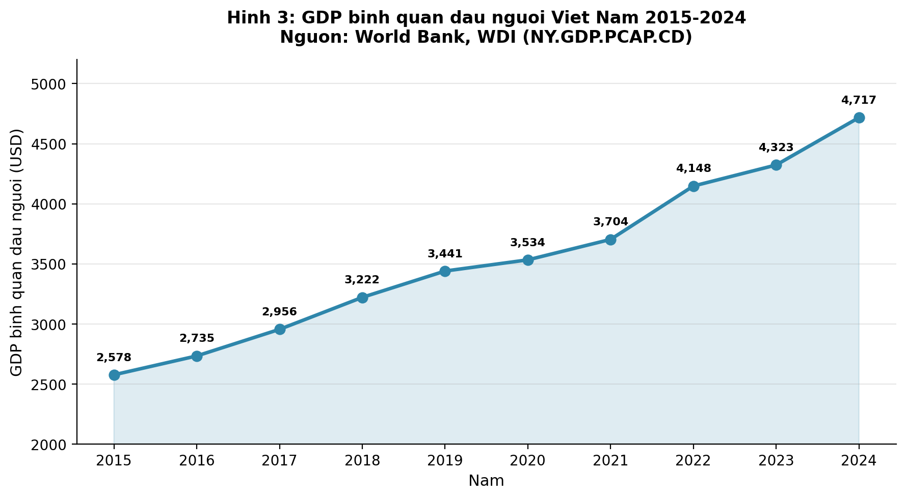
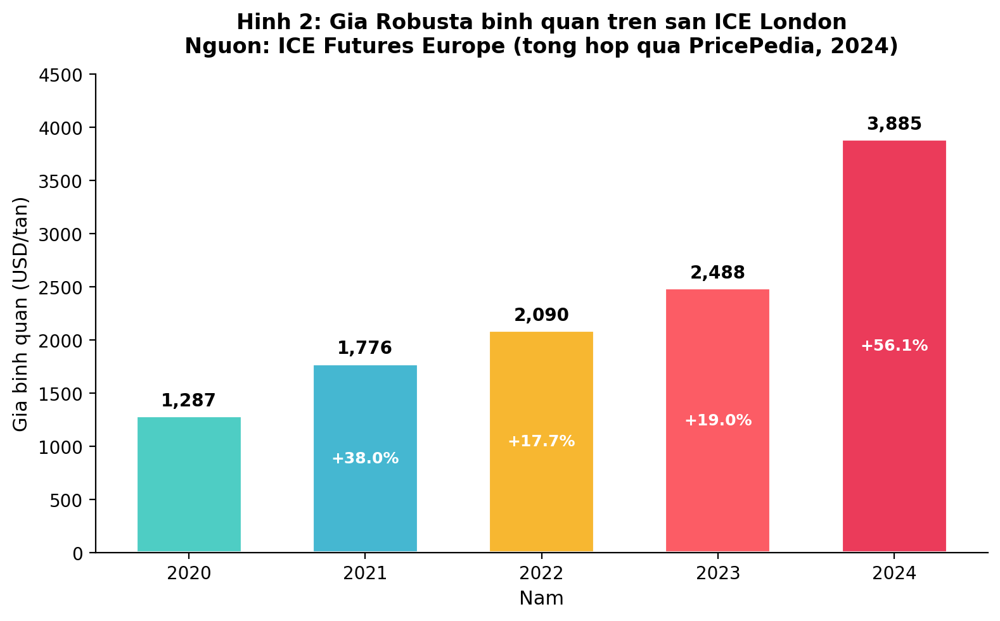

# BÀI TIỂU LUẬN MÔN KINH TẾ VI MÔ

**Câu 1:** Phân tích các yếu tố tác động đến cầu và cung của một sản phẩm/hàng hóa cụ thể trên thị trường.

**Câu 2:** Cạnh tranh hoàn hảo là gì? Điều kiện nào cần thiết để một thị trường được coi là cạnh tranh hoàn hảo và tại sao trong thị trường này, doanh nghiệp không thể quyết định giá? Cho ví dụ minh họa.

---

**Học viên:** ...............................................

**Lớp:** Bổ sung kiến thức Thạc sĩ

**Giảng viên hướng dẫn:** TS. Trần Thị Thanh Diệu

**Trường Đại học Quy Nhơn — Khoa Tài chính - Ngân hàng & Quản trị Kinh doanh**

---

\newpage

## LỜI MỞ ĐẦU

Kinh tế vi mô nghiên cứu hành vi ra quyết định của các chủ thể kinh tế trong bối cảnh nguồn lực khan hiếm. Hai nội dung cốt lõi của bộ môn này là lý thuyết cung–cầu và lý thuyết về cấu trúc thị trường. Lý thuyết cung–cầu giải thích cơ chế hình thành giá cả và phân bổ nguồn lực; lý thuyết cấu trúc thị trường — đặc biệt mô hình cạnh tranh hoàn hảo — cung cấp điểm chuẩn để đánh giá hiệu quả hoạt động của các loại thị trường khác nhau.

Bài tiểu luận này trình bày hai nội dung. Phần thứ nhất phân tích các yếu tố tác động đến cung và cầu của **cà phê** trên thị trường Việt Nam — một mặt hàng nông sản xuất khẩu chủ lực, gắn liền với đời sống kinh tế và tiêu dùng hàng ngày. Phần thứ hai trình bày lý thuyết về thị trường cạnh tranh hoàn hảo: khái niệm, điều kiện, lý giải tại sao doanh nghiệp không thể quyết định giá, kèm ví dụ minh họa.

Bài viết dựa trên giáo trình *Kinh tế vi mô* của Đỗ Ngọc Mỹ và cộng sự (2017, Trường Đại học Quy Nhơn), các giáo trình kinh tế vi mô trong nước và quốc tế, kết hợp số liệu từ Bộ Nông nghiệp và Phát triển Nông thôn (Bộ NN&PTNT), Tổng cục Hải quan, World Bank và các tổ chức quốc tế.

---

\newpage

## PHẦN I. PHÂN TÍCH CÁC YẾU TỐ TÁC ĐỘNG ĐẾN CẦU VÀ CUNG CỦA CÀ PHÊ TRÊN THỊ TRƯỜNG VIỆT NAM

### 1.1. Giới thiệu sản phẩm và thị trường cà phê Việt Nam

Việt Nam là quốc gia sản xuất cà phê lớn thứ hai thế giới (sau Brazil) và là nước xuất khẩu Robusta lớn nhất. Theo Bộ NN&PTNT, diện tích trồng cà phê cả nước đạt khoảng 710.000 ha, trong đó vùng Tây Nguyên chiếm gần 672.000 ha, tương đương 95,5% tổng diện tích (Bộ NN&PTNT, Báo cáo thường niên cà phê 2023).

Năm 2024, xuất khẩu cà phê Việt Nam đạt kỷ lục 5,48 tỷ USD với khoảng 1,32 triệu tấn, giá bình quân 4.151 USD/tấn — tăng mạnh so với 2,66 tỷ USD của năm 2020 (Bộ NN&PTNT, qua VnEconomy, 2025). Song song với xuất khẩu, thị trường tiêu dùng nội địa cũng phát triển nhanh: lượng tiêu thụ trong nước ước đạt khoảng 3,2 triệu bao loại 60 kg/năm (USDA, PSD Database, 2023/24).

**Bảng 1: Xuất khẩu cà phê Việt Nam giai đoạn 2020–2024**

| Năm | Sản lượng XK (triệu tấn) | Giá trị XK (tỷ USD) | Giá BQ (USD/tấn) |
|:---:|:---:|:---:|:---:|
| 2020 | 1,57 | 2,66 | ~1.694 |
| 2021 | 1,56 | 3,07 | ~1.968 |
| 2022 | 1,78 | 4,06 | ~2.281 |
| 2023 | 1,62 | 4,18 | ~2.580 |
| 2024 | 1,32 | 5,48 | ~4.151 |

*Nguồn: Bộ NN&PTNT, Tổng cục Hải quan (tổng hợp qua Agro.gov.vn và VnEconomy, 2025).*

Bảng 1 và Hình 1 cho thấy một nghịch lý đáng chú ý: sản lượng xuất khẩu giảm từ 1,78 triệu tấn (2022) xuống 1,32 triệu tấn (2024), nhưng giá trị kim ngạch lại tăng từ 4,06 lên 5,48 tỷ USD. Nguyên nhân chính nằm ở sự tăng vọt của giá cà phê thế giới — phản ánh sự tương tác phức tạp giữa các yếu tố cung và cầu sẽ được phân tích dưới đây.

### 1.2. Cơ sở lý thuyết về cầu và cung

#### 1.2.1. Khái niệm cầu và luật cầu

Theo Đỗ Ngọc Mỹ và cộng sự (2017), **cầu** là số lượng hàng hóa hay dịch vụ mà người mua có khả năng và sẵn sàng mua ở các mức giá khác nhau trong một thời gian nhất định. Cầu chỉ hình thành khi hội tụ đủ hai điều kiện: *mong muốn* (willingness) và *có khả năng thanh toán* (ability to pay).

**Luật cầu** phát biểu: với giả định các yếu tố khác không đổi (*ceteris paribus*), lượng cầu tăng khi giá giảm và ngược lại. Luật cầu được giải thích bởi hai hiệu ứng: hiệu ứng thay thế (người tiêu dùng chuyển sang hàng hóa rẻ hơn khi giá tăng) và hiệu ứng thu nhập (giá tăng làm giảm sức mua thực tế). Hàm cầu tổng quát có dạng:

$$Q_D^X = f(P_X,\ P_Y,\ I,\ N,\ T,\ E,\ ...)$$

Trong đó: $P_X$ — giá hàng hóa X; $P_Y$ — giá hàng hóa liên quan; $I$ — thu nhập; $N$ — quy mô thị trường; $T$ — thị hiếu; $E$ — kỳ vọng.

#### 1.2.2. Khái niệm cung và luật cung

**Cung** là số lượng hàng hóa hay dịch vụ mà người bán có khả năng và sẵn sàng bán ở các mức giá khác nhau trong một khoảng thời gian nhất định. **Luật cung** phát biểu: với giả định các yếu tố khác không đổi, lượng cung tăng khi giá tăng và ngược lại. Động cơ cơ bản là lợi nhuận: giá cao hơn mở rộng biên lợi nhuận, khuyến khích sản xuất thêm. Hàm cung tổng quát:

$$Q_S^X = g(P_X,\ P_Y,\ Te,\ G,\ E,\ ...)$$

Trong đó: $P_Y$ — giá yếu tố sản xuất; $Te$ — công nghệ; $G$ — chính sách chính phủ; $E$ — kỳ vọng nhà sản xuất.

Khi giá bản thân hàng hóa thay đổi, ta có **sự vận động dọc theo đường cung (hoặc cầu)**. Khi bất kỳ yếu tố nào khác ngoài giá thay đổi, toàn bộ đường cung (hoặc cầu) **dịch chuyển** sang phải hoặc sang trái.

### 1.3. Các yếu tố tác động đến cầu cà phê

#### 1.3.1. Giá bản thân cà phê (yếu tố nội sinh — vận động dọc đường cầu)

Giá cà phê là yếu tố trực tiếp nhất ảnh hưởng đến lượng cầu. Theo luật cầu, giá tăng thì lượng cầu giảm và ngược lại. Tuy nhiên, cà phê là mặt hàng có **độ co giãn cầu theo giá tương đối thấp** ở phân khúc tiêu dùng thường nhật vì tính gây quen và thói quen hàng ngày của người tiêu dùng. Nghiên cứu của Capps và cộng sự (2023) trên dữ liệu NielsenIQ tại Hoa Kỳ cho thấy hệ số co giãn cầu theo giá của cà phê tại nhà (at-home coffee) ước tính khoảng −1,93, nhưng trong bối cảnh thị trường Việt Nam nơi cà phê vỉa hè có giá rất thấp, người tiêu dùng phân khúc bình dân ít nhạy cảm hơn với biến động giá nhỏ.

#### 1.3.2. Thu nhập của người tiêu dùng (dịch chuyển đường cầu)

Thu nhập tăng làm tăng khả năng chi trả, từ đó tăng cầu đối với các hàng hóa thông thường. Cà phê — đặc biệt cà phê chế biến sẵn và cà phê đặc sản — được xem là hàng hóa thông thường (normal good): khi thu nhập tăng, người tiêu dùng không chỉ uống nhiều hơn mà còn chuyển sang phân khúc cao cấp hơn.

Số liệu từ World Bank cho thấy GDP bình quân đầu người của Việt Nam tăng từ 2.578 USD (2015) lên 4.717 USD (2024) — tăng 83% trong một thập kỷ. Sự tăng trưởng thu nhập này là động lực chính thúc đẩy sự bùng nổ của chuỗi cà phê cao cấp: theo iPOS.vn, năm 2023 cả nước có khoảng 317.000 quán cà phê và trà, trong đó riêng Highlands Coffee đạt 777 cửa hàng (Comunicaffe, 2024).

**Bảng 2: GDP bình quân đầu người Việt Nam 2015–2024**

| Năm | 2015 | 2016 | 2017 | 2018 | 2019 | 2020 | 2021 | 2022 | 2023 | 2024 |
|:---:|:---:|:---:|:---:|:---:|:---:|:---:|:---:|:---:|:---:|:---:|
| USD | 2.578 | 2.735 | 2.956 | 3.222 | 3.441 | 3.534 | 3.704 | 4.148 | 4.323 | 4.717 |

*Nguồn: World Bank, World Development Indicators (NY.GDP.PCAP.CD), truy cập 2025.*

Tuy nhiên, theo quy luật Engel, đối với phân khúc cà phê bột pha phin giá rẻ, khi thu nhập vượt một ngưỡng nhất định, một bộ phận người tiêu dùng chuyển sang cà phê máy hoặc trà sữa cao cấp, khiến cà phê bột bình dân có thể trở thành hàng hóa thứ cấp (inferior good) đối với nhóm thu nhập cao. Điều này cho thấy tính chất hàng hóa thông thường hay thứ cấp không cố hữu mà phụ thuộc vào phân khúc và bối cảnh tiêu dùng.

#### 1.3.3. Giá hàng hóa liên quan (dịch chuyển đường cầu)

**Hàng hóa thay thế:** Trà, nước giải khát, trà sữa, và thức uống năng lượng là các sản phẩm thay thế cho cà phê ở các mức độ khác nhau. Khi giá trà sữa giảm hoặc các chuỗi trà sữa mở rộng khuyến mãi, một bộ phận người tiêu dùng trẻ chuyển từ cà phê sang trà sữa, làm giảm cầu cà phê. Theo lý thuyết, khi giá hàng thay thế tăng, cầu hàng hóa đang xét tăng, và ngược lại.

**Hàng hóa bổ sung:** Đường, sữa đặc, sữa tươi là hàng hóa bổ sung được tiêu dùng kèm cà phê. Khi giá sữa đặc tăng, chi phí tổng thể cho một ly cà phê sữa tăng theo, có thể làm giảm cầu cà phê, đặc biệt ở phân khúc bình dân. Ngược lại, khi giá hàng bổ sung giảm, cầu cà phê có xu hướng tăng.

#### 1.3.4. Quy mô thị trường và xu hướng đô thị hóa (dịch chuyển đường cầu)

Việt Nam có dân số gần 100 triệu người với tỷ lệ dân số trẻ (dưới 35 tuổi) cao. Quá trình đô thị hóa nhanh — tỷ lệ dân số đô thị tăng từ khoảng 30% (2010) lên trên 38% (2023) — mở rộng đáng kể cơ sở khách hàng cho ngành cà phê, bởi cư dân đô thị có lối sống hiện đại và nhu cầu uống cà phê cao hơn khu vực nông thôn.

#### 1.3.5. Sở thích, thị hiếu và xu hướng tiêu dùng (dịch chuyển đường cầu)

Văn hóa uống cà phê đã ăn sâu vào đời sống xã hội Việt Nam. Xu hướng chuyển từ cà phê hòa tan sang cà phê pha máy (espresso-based), hay sự ưa chuộng cà phê đặc sản (specialty coffee), đã làm thay đổi cấu trúc cầu. Xu hướng sống khỏe cũng tác động hai chiều: các nghiên cứu y khoa cho thấy cà phê có lợi khi dùng hợp lý thúc đẩy cầu, nhưng lo ngại về caffein có thể khiến một bộ phận giảm tiêu thụ.

#### 1.3.6. Kỳ vọng và các yếu tố khách quan khác (dịch chuyển đường cầu)

Nếu người tiêu dùng dự đoán giá cà phê sẽ tăng (do thông tin mất mùa), họ có xu hướng mua dự trữ, tăng cầu hiện tại. Ngoài ra, yếu tố mùa vụ (mùa lạnh tăng cầu cà phê nóng), dịch bệnh (COVID-19 giảm cầu tại quán nhưng tăng cầu cà phê pha tại nhà) cũng tác động đáng kể.

### 1.4. Các yếu tố tác động đến cung cà phê

#### 1.4.1. Giá bản thân cà phê (yếu tố nội sinh — vận động dọc đường cung)

Theo luật cung, giá cà phê tăng khuyến khích nhà sản xuất mở rộng sản lượng. Tuy nhiên, cà phê là cây công nghiệp lâu năm, cần 3–5 năm từ khi trồng đến khi cho thu hoạch ổn định, nên phản ứng của cung có **độ trễ đáng kể** trong ngắn hạn.

Giá Robusta bình quân trên sàn ICE London tăng liên tục từ 1.287 USD/tấn (2020) lên 3.885 USD/tấn (2024) — tăng hơn 200% (ICE Futures Europe, tổng hợp qua PricePedia, 2024). Sự tăng giá này đã thúc đẩy nhiều nông dân Tây Nguyên mở rộng diện tích hoặc chuyển đổi từ cây trồng khác sang cà phê, nhưng sản lượng thực tế chỉ tăng sau vài năm.

**Bảng 3: Giá cà phê Robusta bình quân trên sàn ICE London**

| Năm | 2020 | 2021 | 2022 | 2023 | 2024 |
|:---:|:---:|:---:|:---:|:---:|:---:|
| USD/tấn | 1.287 | 1.776 | 2.090 | 2.488 | 3.885 |
| % tăng YoY | — | +38,0% | +17,7% | +19,0% | +56,1% |

*Nguồn: ICE Futures Europe, tổng hợp qua PricePedia (2024).*

#### 1.4.2. Giá các yếu tố sản xuất (dịch chuyển đường cung sang trái)

Chi phí sản xuất cà phê phụ thuộc vào phân bón, thuốc bảo vệ thực vật, lao động, nước tưới và máy móc. Khi giá đầu vào tăng, chi phí sản xuất tăng, biên lợi nhuận giảm, một số nhà sản xuất thu hẹp quy mô — đường cung dịch chuyển sang trái.

Phân bón chiếm tỷ trọng lớn trong cơ cấu chi phí nông nghiệp (hơn 40% chi phí đầu vào nông nghiệp, theo Bộ NN&PTNT). Trong giai đoạn 2021–2022, xung đột Nga–Ukraine đẩy giá phân bón lên mức cao nhất trong 50 năm: giá Kali tăng từ 200–300 USD/tấn lên khoảng 1.000 USD/tấn (Vietnam News, dẫn nguồn Bộ NN&PTNT, 11/5/2022). Sự tăng giá này trực tiếp làm tăng chi phí sản xuất cà phê, đặc biệt ảnh hưởng nặng đến các hộ nông dân nhỏ lẻ.

Chi phí lao động cũng là yếu tố quan trọng. Tại Tây Nguyên, tình trạng thiếu lao động thu hoạch vào mùa vụ (tháng 10–12) đẩy giá thuê lao động thời vụ tăng, góp phần tăng chi phí sản xuất.

#### 1.4.3. Công nghệ sản xuất (dịch chuyển đường cung sang phải)

Tiến bộ kỹ thuật canh tác — hệ thống tưới tiêu tự động, giống cà phê năng suất cao, kỹ thuật tái canh — giúp tăng năng suất. Theo Solidaridad (2024, dẫn nguồn BASIC), năng suất cà phê Việt Nam đạt khoảng 2,8 tấn/ha, thuộc nhóm cao nhất thế giới. Công nghệ chế biến sau thu hoạch (chuyển từ chế biến khô sang chế biến ướt, chế biến mật ong) cũng nâng cao giá trị sản phẩm, khuyến khích mở rộng cung.

#### 1.4.4. Chính sách chính phủ (dịch chuyển đường cung)

Chính phủ Việt Nam triển khai nhiều chính sách hỗ trợ: chương trình tái canh cà phê với lãi suất ưu đãi, miễn giảm thuế xuất khẩu, hỗ trợ kỹ thuật canh tác. Những chính sách này làm giảm chi phí sản xuất hoặc tăng lợi nhuận kỳ vọng, thúc đẩy đường cung dịch chuyển sang phải.

Ngược lại, các quy định về bảo vệ môi trường, tiêu chuẩn an toàn thực phẩm, yêu cầu truy xuất nguồn gốc (đặc biệt theo quy định EUDR của EU) có thể tăng chi phí tuân thủ trong ngắn hạn, tạo áp lực lên cung.

#### 1.4.5. Kỳ vọng của nhà sản xuất (dịch chuyển đường cung)

Nếu nông dân dự báo giá tiếp tục tăng, họ có thể **ghim hàng** (giữ lại không bán) để chờ giá cao hơn, làm giảm lượng cung thực tế trên thị trường giao ngay. Hiện tượng này xảy ra rõ rệt trong niên vụ 2023–2024 khi giá Robusta liên tục lập đỉnh: nhiều nông dân và thương lái chọn chiến lược ghim hàng, khiến lượng cung thị trường giao ngay giảm mạnh, đẩy giá nội địa tăng vọt.

#### 1.4.6. Điều kiện tự nhiên và biến đổi khí hậu (dịch chuyển đường cung sang trái)

Cà phê nhạy cảm với biến đổi khí hậu: hạn hán, mưa trái mùa, sương giá, dịch bệnh cây trồng đều ảnh hưởng trực tiếp đến sản lượng. Theo Bộ NN&PTNT (qua VietnamPlus, 29/5/2024), sản lượng cà phê niên vụ 2023–2024 ước đạt khoảng 1,47 triệu tấn, **giảm 20%** so với niên vụ trước, nguyên nhân chính là hạn hán liên quan đến hiện tượng El Niño.

Nghiên cứu của Bunn và cộng sự (2015) đăng trên tạp chí *Climatic Change* dự báo diện tích đất phù hợp cho canh tác cà phê Arabica toàn cầu có thể giảm khoảng 50% đến năm 2050, trong đó Brazil và Việt Nam chịu ảnh hưởng lớn (Bunn, Läderach, Ovalle Rivera & Kirschke, 2015, DOI: 10.1007/s10584-014-1306-x).

### 1.5. Phân tích cân bằng cung–cầu và sự biến động giá cà phê

Theo lý thuyết, trạng thái cân bằng thị trường đạt được khi lượng cung bằng lượng cầu tại một mức giá xác định. Giá và sản lượng cân bằng phản ánh sự vận hành khách quan của cơ chế thị trường mà Adam Smith (1776) gọi là "bàn tay vô hình". Khi bất kỳ yếu tố ngoại sinh nào thay đổi, trạng thái cân bằng cũ bị phá vỡ và cân bằng mới được thiết lập.

Sự biến động trên thị trường cà phê Việt Nam giai đoạn 2020–2024 minh họa rõ nét cơ chế này:

**Giai đoạn 2020–2021 (cú sốc COVID-19):** Đại dịch gây ra "cú sốc kép" — cầu cà phê tại quán giảm mạnh do giãn cách xã hội (đường cầu dịch trái), trong khi cung cũng bị ảnh hưởng bởi gián đoạn chuỗi cung ứng và thiếu container vận chuyển (đường cung dịch trái). Kết quả: sản lượng giao dịch giảm nhưng giá biến động phức tạp tùy mức dịch chuyển tương đối của hai đường.

**Giai đoạn 2023–2024 (giá kỷ lục):** Sự kết hợp đồng thời của: (i) hạn hán El Niño giảm sản lượng 20% (cung dịch trái mạnh); (ii) cầu thế giới phục hồi sau đại dịch (cầu dịch phải); (iii) nông dân ghim hàng chờ giá (cung giao ngay giảm thêm) — đã đẩy giá Robusta lên mức kỷ lục lịch sử. Đường cung dịch trái mạnh hơn nhiều so với sự dịch chuyển của đường cầu, dẫn đến giá cân bằng mới cao hơn đáng kể. Kết quả là: sản lượng xuất khẩu giảm xuống 1,32 triệu tấn (thấp nhất 5 năm) nhưng kim ngạch đạt 5,48 tỷ USD (cao nhất lịch sử), như số liệu Bảng 1 đã chỉ ra.

**Bảng 4: Tóm tắt các yếu tố tác động đến cung–cầu cà phê Việt Nam**

| Yếu tố | Tác động đến CẦU | Tác động đến CUNG |
|---|---|---|
| Giá bản thân cà phê | Vận động dọc đường cầu (luật cầu) | Vận động dọc đường cung (luật cung) |
| Thu nhập người tiêu dùng | ↑ Thu nhập → ↑ Cầu (hàng hóa thông thường) | — |
| Giá hàng thay thế (trà, nước giải khát) | ↑ Giá hàng thay thế → ↑ Cầu cà phê | — |
| Giá hàng bổ sung (sữa, đường) | ↑ Giá hàng bổ sung → ↓ Cầu cà phê | — |
| Quy mô thị trường, đô thị hóa | ↑ Dân số đô thị → ↑ Cầu | — |
| Thị hiếu, xu hướng tiêu dùng | Thay đổi sở thích → dịch chuyển cầu | — |
| Kỳ vọng giá tương lai | Kỳ vọng giá ↑ → ↑ Cầu hiện tại (mua dự trữ) | Kỳ vọng giá ↑ → ↓ Cung hiện tại (ghim hàng) |
| Giá yếu tố đầu vào (phân bón, lao động) | — | ↑ Chi phí đầu vào → ↓ Cung |
| Công nghệ sản xuất | — | Tiến bộ công nghệ → ↑ Cung |
| Chính sách chính phủ | — | Trợ cấp, ưu đãi thuế → ↑ Cung |
| Thời tiết, biến đổi khí hậu | Mùa vụ → thay đổi cầu theo mùa | Hạn hán, El Niño → ↓ Cung |

---

\newpage

## PHẦN II. CẠNH TRANH HOÀN HẢO VÀ VẤN ĐỀ QUYẾT ĐỊNH GIÁ CỦA DOANH NGHIỆP

### 2.1. Khái niệm cạnh tranh hoàn hảo

Cạnh tranh hoàn hảo (perfect competition) là một cấu trúc thị trường trong đó có rất nhiều người bán và người mua, và không một cá nhân hay doanh nghiệp nào có đủ sức mạnh để ảnh hưởng đến giá cả thị trường. Theo David Begg, Stanley Fischer và Rudiger Dornbusch (2007), thị trường cạnh tranh hoàn hảo là thị trường trong đó cả người mua lẫn người bán đều tin rằng các quyết định mua bán của riêng họ không ảnh hưởng đến giá thị trường.

Khái niệm này được Frank Knight (1921) hệ thống hóa rõ ràng trong tác phẩm *Risk, Uncertainty, and Profit*. Knight chỉ ra rằng lý thuyết kinh tế truyền thống dựa trên giả định cạnh tranh hoàn hảo nhưng "tính chất chính xác của giả định này vẫn chưa từng được trình bày đầy đủ" (*partially implicit and never adequately formulated*), từ đó ông liệt kê và hệ thống hóa các điều kiện cần thiết để thị trường đạt trạng thái cạnh tranh hoàn hảo.

Theo Đỗ Ngọc Mỹ và cộng sự (2017), cạnh tranh hoàn hảo là mô hình được sử dụng làm tiêu chuẩn đối chiếu (benchmark) để đánh giá hiệu quả của các cấu trúc thị trường khác. Mặc dù hiếm khi tồn tại ở dạng thuần túy trong thực tế, mô hình này cho thấy trạng thái mà tại đó nguồn lực xã hội được phân bổ hiệu quả nhất — đạt hiệu quả Pareto.

### 2.2. Các điều kiện cần thiết của thị trường cạnh tranh hoàn hảo

Để một thị trường được coi là cạnh tranh hoàn hảo, cần thỏa mãn đồng thời bốn điều kiện sau:

#### 2.2.1. Số lượng lớn người bán và người mua

Số lượng người bán và người mua phải đủ lớn để phần đóng góp (thị phần) của bất kỳ cá nhân hay doanh nghiệp nào trong tổng cung hoặc tổng cầu đều không đáng kể. Hệ quả là quyết định tăng hay giảm sản lượng của một doanh nghiệp riêng lẻ không tác động đến tổng cung thị trường, do đó không ảnh hưởng đến giá. Tương tự, quyết định mua hay không mua của một người tiêu dùng cũng không thể chi phối giá cả.

Điều kiện này phân biệt cạnh tranh hoàn hảo với các cấu trúc khác: độc quyền thuần túy chỉ có một người bán, độc quyền nhóm chỉ có một vài người bán chiếm thị phần lớn.

#### 2.2.2. Sản phẩm đồng nhất (homogeneous)

Tất cả sản phẩm trên thị trường phải hoàn toàn giống nhau — sản phẩm của doanh nghiệp này có thể thay thế hoàn hảo cho sản phẩm của doanh nghiệp khác. Người tiêu dùng không có lý do ưa thích sản phẩm của nhà sản xuất nào cụ thể. Tính đồng nhất loại bỏ khả năng khác biệt hóa sản phẩm (product differentiation), buộc cạnh tranh chỉ dựa trên yếu tố giá cả duy nhất.

#### 2.2.3. Thông tin hoàn hảo (perfect information)

Tất cả các bên tham gia thị trường đều có đầy đủ và chính xác thông tin về giá cả, chất lượng sản phẩm, công nghệ sản xuất và mọi điều kiện thị trường. George Stigler (1961) đã chỉ ra rằng thông tin hoàn hảo là điều kiện cần thiết để thị trường vận hành hiệu quả: khi thông tin bất cân xứng, các quyết định kinh tế bị bóp méo, dẫn đến phân bổ nguồn lực không tối ưu.

Thông tin hoàn hảo đảm bảo: người mua biết rõ mức giá của tất cả nhà sản xuất nên không ai có thể bán giá cao hơn mà không mất khách; nhà sản xuất biết rõ công nghệ tốt nhất, giá đầu vào và giá bán của đối thủ. Do đó, **luật một giá** (law of one price) được thi hành: chỉ tồn tại một mức giá duy nhất cho sản phẩm đồng nhất.

#### 2.2.4. Tự do gia nhập và rút khỏi thị trường

Không có rào cản pháp lý, tài chính hay kỹ thuật nào ngăn cản doanh nghiệp mới gia nhập hoặc doanh nghiệp hiện tại rời khỏi thị trường. Khi doanh nghiệp trong ngành thu lợi nhuận kinh tế dương, doanh nghiệp mới sẽ gia nhập, tăng cung, đẩy giá giảm cho đến khi lợi nhuận kinh tế bằng không. Ngược lại, khi thua lỗ, doanh nghiệp có thể rời ngành mà không chịu chi phí chìm quá lớn. Cơ chế ra vào tự do này tạo nên tính tự điều chỉnh của thị trường cạnh tranh hoàn hảo (Ngô Đình Giao, 2004).

### 2.3. Tại sao doanh nghiệp không thể quyết định giá

Trong thị trường cạnh tranh hoàn hảo, doanh nghiệp là **"người chấp nhận giá" (price taker)** — phải chấp nhận mức giá do thị trường quyết định mà không có khả năng tác động. Lý do cụ thể như sau:

**Thứ nhất, thị phần quá nhỏ.** Mỗi doanh nghiệp chỉ cung ứng một phần cực nhỏ trong tổng cung. Dù tăng gấp đôi hoặc giảm một nửa sản lượng, tổng cung thị trường hầu như không thay đổi và giá vẫn giữ nguyên. Đường cầu mà mỗi doanh nghiệp đối mặt là **đường nằm ngang** (hoàn toàn co giãn) tại mức giá thị trường P*.

**Thứ hai, sản phẩm đồng nhất loại bỏ cơ sở tăng giá.** Vì sản phẩm hoàn toàn giống nhau, nếu doanh nghiệp A nâng giá cao hơn giá thị trường dù chỉ một đồng, toàn bộ khách hàng sẽ chuyển sang mua từ doanh nghiệp khác. Doanh nghiệp mất 100% doanh số nếu bán giá cao hơn P*.

**Thứ ba, thông tin hoàn hảo ngăn chặn mọi nỗ lực tăng giá.** Người tiêu dùng biết rõ giá của tất cả nhà cung cấp, nên bất kỳ nỗ lực bán giá cao hơn nào đều bị phát hiện ngay lập tức.

**Thứ tư, doanh nghiệp cũng không có động cơ bán giá thấp hơn P*.** Tại mức giá thị trường, doanh nghiệp đã có thể bán bất kỳ lượng hàng nào. Hạ giá chỉ giảm doanh thu mà không mang lại lợi thế nào.

Hệ quả quan trọng: giá bán bằng doanh thu cận biên bằng doanh thu bình quân ($P = MR = AR$). Doanh nghiệp tối đa hóa lợi nhuận bằng cách chọn sản lượng tại đó $MC = MR = P$, tức **chỉ ra quyết định về sản lượng, không phải về giá**. Giá cả được quyết định bởi quy luật cung–cầu thị trường thông qua "bàn tay vô hình" (Adam Smith, 1776): sự tương tác giữa tổng cung và tổng cầu tự động xác định mức giá cân bằng.

Trong dài hạn, cơ chế tự do gia nhập và rút lui đảm bảo lợi nhuận kinh tế bằng không ($\pi_{economic} = 0$), giá bằng chi phí bình quân dài hạn tối thiểu ($P = LAC_{min}$), phản ánh hiệu quả phân bổ nguồn lực cao nhất.

### 2.4. Ví dụ minh họa: thị trường lúa gạo tại Việt Nam

Thị trường lúa gạo tại Việt Nam là ví dụ gần sát nhất với mô hình cạnh tranh hoàn hảo trong thực tế, đáp ứng khá tốt cả bốn điều kiện:

**Số lượng lớn người bán và người mua:** Có hàng triệu hộ nông dân trồng lúa (người bán) và hàng chục triệu hộ gia đình tiêu dùng gạo hàng ngày (người mua). Sản lượng lúa cả nước đạt khoảng 43–44 triệu tấn/năm (Tổng cục Thống kê). Mỗi hộ nông dân chỉ sản xuất một phần cực nhỏ so với tổng sản lượng quốc gia, nên không hộ nào có khả năng chi phối giá.

**Sản phẩm tương đối đồng nhất:** Gạo cùng loại (ví dụ gạo IR 504, gạo ST25) có chất lượng tương đối đồng nhất giữa các hộ sản xuất. Người mua thường không phân biệt gạo IR 504 của hộ A và hộ B nếu cùng vùng sản xuất và cùng tiêu chuẩn.

**Thông tin tương đối phổ biến:** Giá gạo được niêm yết tại các chợ, thương lái và sàn giao dịch nông sản. Nông dân có thể dễ dàng so sánh giá giữa các thương lái trước khi bán.

**Rào cản gia nhập thấp:** Không có rào cản pháp lý đáng kể để nông dân bắt đầu hoặc ngừng trồng lúa. Đất lúa có thể chuyển sang trồng rau, hoa màu hoặc ngược lại trong thời gian tương đối ngắn.

Trong thị trường này, mỗi hộ nông dân là "người chấp nhận giá" — họ bán gạo theo giá phổ biến tại thời điểm thu hoạch và không có khả năng đàm phán tăng giá vượt mức giá chung. Nếu một hộ nông dân đòi bán giá cao hơn 500 đồng/kg so với giá thị trường, thương lái sẽ chuyển sang mua của hộ khác vì gạo cùng loại hoàn toàn tương đương. Ngược lại, hộ nông dân cũng không cần hạ giá vì tại giá thị trường, họ đã bán được toàn bộ sản lượng.

Tuy nhiên, cần thừa nhận rằng thị trường lúa gạo chỉ **gần** cạnh tranh hoàn hảo chứ không hoàn toàn đạt mô hình lý tưởng: thông tin chưa thực sự hoàn hảo (nông dân vùng sâu có thể ít thông tin hơn), sản phẩm chưa đồng nhất tuyệt đối (gạo ST25 khác hẳn gạo IR 504), và chính phủ đôi khi can thiệp giá thu mua tạm trữ. Mặc dù vậy, so với các cấu trúc thị trường khác — độc quyền (như EVN trong ngành điện) hay độc quyền nhóm (như Viettel–Mobifone–Vinaphone trong viễn thông) — thị trường lúa gạo thể hiện đầy đủ nhất các đặc trưng của cạnh tranh hoàn hảo và minh họa rõ ràng tại sao doanh nghiệp (hộ nông dân) trong thị trường này không thể quyết định giá.

---

\newpage

## KẾT LUẬN

Qua phân tích trong bài tiểu luận, có thể rút ra một số kết luận chính:

**Thứ nhất**, cung và cầu là hai lực lượng cơ bản quyết định giá cả và sản lượng trên thị trường. Qua trường hợp cà phê Việt Nam, bài viết cho thấy cầu chịu tác động đồng thời của nhiều yếu tố: giá bản thân sản phẩm, thu nhập người tiêu dùng, giá hàng hóa liên quan, quy mô thị trường, sở thích, kỳ vọng, và các yếu tố khách quan. Cung chịu chi phối bởi giá sản phẩm, giá đầu vào, công nghệ, chính sách chính phủ, kỳ vọng nhà sản xuất, và điều kiện tự nhiên. Số liệu thực tế giai đoạn 2020–2024 — với giá Robusta tăng hơn 200%, sản lượng giảm 20% do El Niño, nhưng kim ngạch xuất khẩu đạt kỷ lục 5,48 tỷ USD — minh họa sinh động cơ chế tương tác cung–cầu trong thực tiễn.

**Thứ hai**, cạnh tranh hoàn hảo là cấu trúc thị trường lý tưởng đòi hỏi đồng thời bốn điều kiện: số lượng lớn người tham gia, sản phẩm đồng nhất, thông tin hoàn hảo, và tự do gia nhập cũng như rút khỏi thị trường. Khi bốn điều kiện này được thỏa mãn, doanh nghiệp trở thành "người chấp nhận giá" vì thị phần quá nhỏ, sản phẩm không có sự khác biệt, và thông tin hoàn hảo ngăn chặn mọi nỗ lực định giá riêng. Giá cả hoàn toàn do quy luật cung–cầu thị trường quyết định.

**Thứ ba**, mặc dù hiếm khi tồn tại thuần túy trong thực tế, mô hình cạnh tranh hoàn hảo vẫn có giá trị lớn cả về lý luận (làm tiêu chuẩn đánh giá hiệu quả thị trường) lẫn thực tiễn (thị trường lúa gạo, nông sản cơ bản mang nhiều đặc trưng gần cạnh tranh hoàn hảo). Việc nắm vững hai lý thuyết cốt lõi này trang bị cho người học công cụ phân tích để hiểu cơ chế vận hành của thị trường và đưa ra quyết định kinh tế đúng đắn.

---

\newpage

## TÀI LIỆU THAM KHẢO

### Giáo trình và sách tham khảo

1. Đỗ Ngọc Mỹ, Đặng Thị Thanh Loan, Nguyễn Thị Kim Ánh (2017). *Giáo trình Kinh tế vi mô*. Trường Đại học Quy Nhơn.
2. Ngô Đình Giao (2004). *Giáo trình Kinh tế học vi mô*. NXB Giáo dục.
3. Bộ Giáo dục và Đào tạo (2005). *Giáo trình Kinh tế học vi mô*. NXB Giáo dục.
4. Begg, D., Fischer, S. & Dornbusch, R. (2007). *Kinh tế học* (bản dịch tiếng Việt). NXB Thống kê.
5. Samuelson, P. A. & Nordhaus, W. D. (2002). *Kinh tế học*, tập 1 (bản dịch tiếng Việt). NXB Thống kê.
6. Mankiw, N. G. (2020). *Principles of Economics* (9th ed.). Cengage Learning.
7. Pindyck, R. S. & Rubinfeld, D. L. (2018). *Microeconomics* (9th ed.). Pearson Education.
8. Smith, A. (1776). *An Inquiry into the Nature and Causes of the Wealth of Nations*. London: W. Strahan & T. Cadell.
9. Knight, F. H. (1921). *Risk, Uncertainty, and Profit*. Boston, MA: Hart, Schaffner & Marx; Houghton Mifflin.

### Bài báo khoa học

10. Stigler, G. J. (1961). The Economics of Information. *Journal of Political Economy*, 69(3), 213–225. DOI: 10.1086/258464.
11. Bunn, C., Läderach, P., Ovalle Rivera, O. & Kirschke, D. (2015). A bitter cup: Climate change profile of global production of Arabica and Robusta coffee. *Climatic Change*, 129, 89–101. DOI: 10.1007/s10584-014-1306-x.
12. Capps, O., Cheng, M., Kee, J. & Priestley, S. L. (2023). A cross-sectional analysis of the demand for coffee in the United States. *Agribusiness*, 39(2), 494–514. DOI: 10.1002/agr.21779.

### Nguồn số liệu và báo cáo

13. Bộ Nông nghiệp và Phát triển Nông thôn (2023). *Báo cáo thường niên ngành cà phê 2023* (Annual Coffee Report 2023 – EN). Truy cập tại: thitruongnongsan.gov.vn.
14. World Bank (2025). World Development Indicators: GDP per capita (current US$) — Vietnam (NY.GDP.PCAP.CD). Truy cập tại: data.worldbank.org.
15. USDA Foreign Agricultural Service (2024). *Coffee: World Markets and Trade*. Báo cáo tháng 6/2024.
16. International Coffee Organization – ICO (2023). *Coffee Report and Outlook – December 2023*.
17. VnEconomy (2025). "Xuất khẩu cà phê đạt kỷ lục 5,48 tỷ USD năm 2024." Truy cập tại: vneconomy.vn.
18. VietnamPlus/VNA (2024). "Coffee output in 2023–2024 crop forecast to fall 20%." Ngày 29/5/2024.
19. Vietnam News (2022). "MARD proposes VAT on fertiliser." Ngày 11/5/2022. Truy cập tại: vietnamnews.vn.
20. Comunicaffe (2024). "Vietnam: the coffee shop sector recorded double-figure growth in 2023." Trích dẫn báo cáo iPOS.vn.
21. PricePedia (2024). "World coffee market: Robusta vs Arabica ICE prices." Tháng 8/2024. Truy cập tại: pricepedia.it.
22. Solidaridad (2024). *The Grounds for Sharing – Annex Vietnam*. Truy cập tại: solidaridadnetwork.org.
