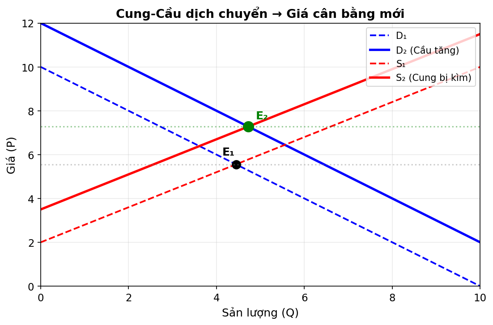
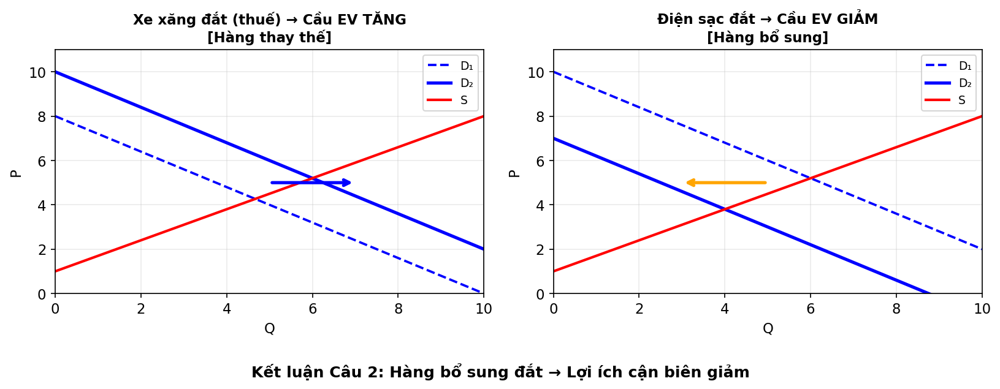
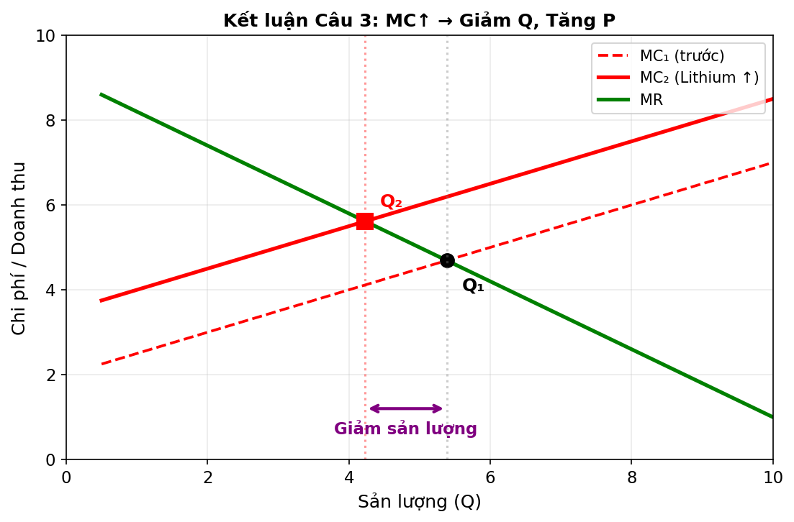
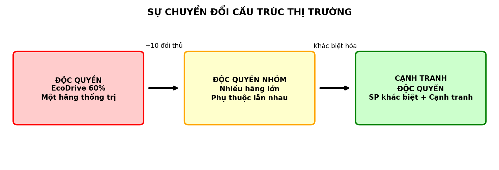
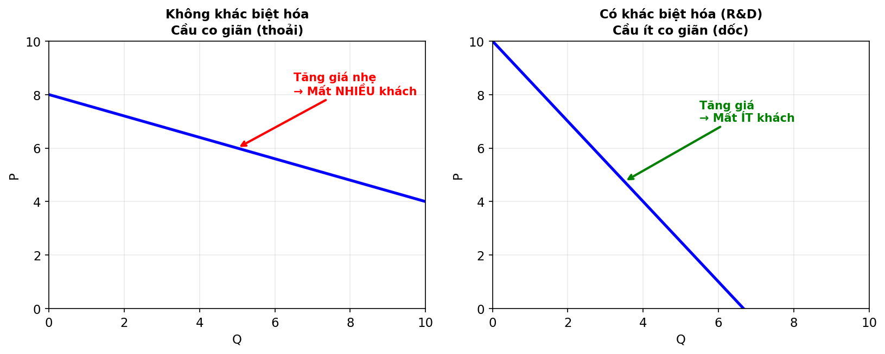

# CUỘC ĐUA XE ĐIỆN TẠI ALPHA

Phân tích kinh tế vi mô từ một thị trường đang chuyển đổi

---

## Bối cảnh tình huống

- Quốc gia Alpha: khai tử xe xăng năm 2035
- "Gọng kìm" chính sách: Thuế xe xăng ↑ + Trợ cấp xe điện
- Thu nhập bình quân: tăng ổn định 10%/năm
- EcoDrive – hãng nội địa chiếm 60% thị phần
- 10+ đối thủ ngoại quốc xâm nhập
- Lithium tăng giá (đứt gãy chuỗi cung ứng)
- Giá điện sạc có xu hướng tăng

---
## Bóc tách dữ liệu (chi tiết)

| Biến số                        | Dữ liệu                           | Loại biến                                |
| ------------------------------ | --------------------------------- | ---------------------------------------- |
| Thu nhập bình quân đầu người   | Tăng 10%/năm                      | Biến ngoại sinh – tác động cầu           |
| Thuế tiêu thụ đặc biệt xe xăng | Tăng vọt                          | Biến ngoại sinh – tác động hàng thay thế |
| Trợ cấp mua xe điện            | Trực tiếp cho người mua           | Biến ngoại sinh – dịch chuyển cầu        |
| Giá Lithium                    | Tăng (đứt gãy chuỗi cung ứng)     | Biến ngoại sinh – tác động cung          |
| Công nghệ pin                  | Tiến bộ, giảm chi phí sản xuất BQ | Biến ngoại sinh – tác động cung          |
| Thị phần EcoDrive              | 60%                               | Cấu trúc thị trường                      |
| Số đối thủ mới                 | Hơn 10 thương hiệu ngoại          | Cấu trúc thị trường                      |
| Giá điện sạc                   | Xu hướng tăng                     | Hàng hóa bổ sung                         |
| Chiến lược cạnh tranh          | R&D + Quảng cáo (phi giá)         | Cạnh tranh phi giá                       |

---

## 1. Phân tích biến động thị trường

---

### Phía Cầu: Ba lực đẩy sang phải

1. **Thu nhập tăng** → xe điện = hàng thông thường, cầu tăng
2. **Trợ cấp** → giảm giá thực tế, tăng khả năng mua
3. **Thuế xe xăng** → hàng thay thế đắt hơn, cầu xe điện tăng

→ Đường cầu dịch mạnh sang phải

---

### Phía Cung: Hai lực ngược chiều

**Đẩy phải:** Công nghệ pin ↑ → chi phí sản xuất giảm

**Kéo trái:** Lithium ↑ → chi phí biên tăng cao

→ Hiệu ứng ròng: Cung không dịch phải đủ mạnh

---

### Kết luận Câu 1: Cầu mạnh + Cung yếu → Giá tăng

> Khi cả Cung và Cầu dịch phải nhưng Lithium kìm Cung lại, áp lực lên giá bán cuối cùng là **TĂNG**. Sản lượng tăng nhưng giá cân bằng mới cao hơn.

---

## 2. Hệ thống hàng hóa liên quan

---

### Xe xăng (hàng thay thế) & Điện sạc (hàng bổ sung)

**Hàng thay thế – Thuế xe xăng:**
- Xe xăng đắt hơn → người dùng chuyển sang xe điện
- Cầu xe điện tăng ✓

**Hàng bổ sung – Giá điện sạc:**
- Điện sạc đắt → chi phí vận hành xe điện tăng
- Lợi ích cận biên (MU) mỗi km bị giảm
- Ưu thế kinh tế của xe điện bị xoi mòn

---

### Kết luận Câu 2: Giá hàng bổ sung tăng → Lung lay sự ưu tiên

> Nếu giá điện sạc tăng vọt, **lợi ích cận biên** của việc sở hữu xe điện giảm nghiêm trọng. Chính sách chỉ hiệu quả khi kiểm soát được toàn bộ hệ thống hàng hóa liên quan.

---

## 3.Bài toán của EcoDrive

---

### Khi Lithium tăng: MC↑ → Điều chỉnh sản lượng và giá

- EcoDrive 60% thị phần nhờ lợi thế quy mô (Economies of Scale)
- Lithium tăng → Chi phí biên (MC – Marginal Cost) dịch lên
- Điểm tối ưu MR=MC dịch sang trái

**Quyết định:**
- **Giảm sản lượng** (dừng sản xuất những xe bị lỗ)
- **Tăng giá vừa phải** (bù chi phí nhưng giữ thị phần)
- Lợi thế quy mô giúp chịu đựng tốt hơn đối thủ nhỏ

---

### Kết luận Câu 3: Tối đa lợi nhuận tại MR = MC

> EcoDrive nên **giảm sản lượng** xuống mức tối ưu mới và **tăng giá vừa phải**. Lợi thế quy mô cho phép họ chịu áp lực chi phí tốt hơn đối thủ nhỏ.

---
## 4.Luật chơi mới: Cạnh tranh phi giá

---

### Cấu trúc thị trường đã thay đổi

Từ độc quyền (EcoDrive thống trị) → Độc quyền nhóm / Cạnh tranh độc quyền

---

### Tại sao đua R&D thay vì đua giá?

**Đua giá = đường cùng:**
- Hãng A giảm → B giảm → tất cả lỗ
- Lithium đắt → không còn dư địa giảm

**Đua R&D + Quảng cáo = tạo quyền lực:**
- Sản phẩm "không giống ai" (tự lái, nội thất thông minh)
- Khách trung thành, ít nhạy cảm với giá
- Đường cầu dốc hơn → quyền lực thị trường cao

---

### Kết luận Câu 4: Khác biệt hóa → Cầu ít co giãn

> Khác biệt hóa sản phẩm **giảm độ co giãn của cầu theo giá** (Price Elasticity ↓) – khách hàng trung thành hơn, ít nhạy cảm với giá hơn – từ đó hãng duy trì quyền lực thị trường cao hơn.

---

## Đánh giá tổng kết

| Câu hỏi | Kết luận |
|----------|----------|
| **Câu 1** | Cầu bùng nổ + Cung bị kìm → Giá chịu áp lực TĂNG |
| **Câu 2** | Giá hàng bổ sung tăng → Xói mòn lợi ích cận biên xe điện |
| **Câu 3** | MR=MC: Giảm sản lượng, tăng giá vừa phải, dựa lợi thế quy mô |
| **Câu 4** | Khác biệt hóa → Cầu ít co giãn → Quyền lực thị trường cao |

---

# Cảm ơn mọi người đã lắng nghe

Hỏi đáp & Thảo luận
